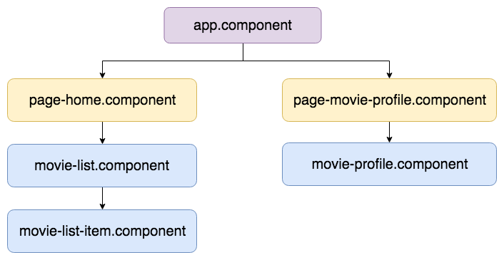
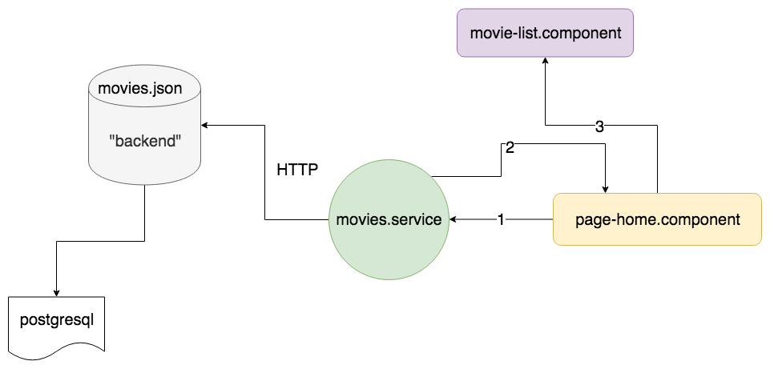

# warsawjs-workshop-28-pwa

**WarsawJS Workshop #28**: Video service app with PWA principles

## Demo 🎉

<https://warsawjs-workshop-28-pwa.herokuapp.com>

## Step by step 👣

### Create project

<details>

* Create directory: `warsawjs-workshop-28-pwa`

    ```bash
    mkdir warsawjs-workshop-28-pwa
    ```

* Enter to new directory

    ```bash
    cd warsawjs-workshop-28-pwa
    ```

* Generate an app

    ```bash
    ng new pwa --directory . --minimal --routing --style css
    ```

* Run Audit: Chrome -> DevTools -> Audits -> Perform an audits

</details>

### Web App Manifest

<details>

* Create file `src/assets/manifest.json`
* In file `angular.json` add below record in `projects/pwa/architect/build/options/assets`

    ```json
    "src/manifest.json",
    ```

    WARNING: Restart server (`ng serve`) after change configuration file

* Add content to `manifest.json` using template:

    ```json
    {
        "short_name": "",
        "name": "",
        "theme_color": "",
        "background_color": "",
        "icons": [],
        "display": "",
        "start_url": ""
    }
    ```
* Use <https://pwabuilder.com/imageGenerator> to build icons

</details>

### Build components structure with routing and services

<details>

* Create files:
    + `src/app/app.components.html`
    + `src/app/app.components.css`
* In `src/app/app.components.ts` change in decorator metadata:
    + `template` -> `templateUrl`
    + `styles` -> `stylesUrl`
* Put paths into above props.
* Generate components:

    ```bash
    ng generate component page-home --spec false
    ng generate component page-movie-profile --spec false
    ng generate component movie-list --spec false
    ng generate component movie-list-item --spec false
    ng generate component movie-profile --spec false
    ```

* Create `src/app/components/` and put all components there
* Create `src/app/components/app/` and put all files with prefix `app.component`
* Build routing in `src/app/app-routing.module.ts`
    + '' = PageHomeComponent
    + 'movies/:id' = PageMovieProfileComponent

* Add link into main header which should redirect to home page
* Create file `src/assets/movies.json`
* Generate interfaces:

    ```bash
    ng generate interface movie
    ng generate interface movies
    ```

* Create directory to group interfaces in one place
* Rename interfaces:
    + `movie.ts` -> `movie.interface.ts`
    + `movies.ts` -> `movies.interface.ts`
* Create a component structure as below:

    

* Generate services:

    ```bash
    ng generate service movies --spec false
    ```

* Create (in service) methods:
    + `getMovies`
    + `getMovieById`

* Inject service `HttpClient` to make HTTP request to `/assets/movies.json` file

    

</details>

## CSS Framework - [Bootstrap](https://getbootstrap.com/)

<details>

* Install `bootstrap` from npm by command

    ```bash
    npm i bootstrap
    ```

* Add new record in `angular.json` -> `projects/pwa/architect/build/options/styles`

    ```text
    "node_modules/bootstrap/dist/css/bootstrap.css"
    ```

    WARNING: Restart server (`ng serve`) after change configuration file

* Use widgets:
    + `card` in `MovieListItemComponent`
    + `media object` in `MovieProfileComponent`

</details>

## Service Worker

<details>

* Create file `src/service-worker.js`
* Install `@angular/service-worker` from npm
* Open `src/app/app.module.ts` and:
    + Import module `ServiceWorkerModule`
    + Add module `ServiceWorkerModule` to `imports` list and use static method
        `register` to put path to file with definition of `ServiceWorker`

* Add new record in `angular.json` -> `projects/pwa/architect/build/options/assets`

    ```text
    "src/service-worker.js",
    ```

    WARNING: Restart server (`ng serve`) after change configuration file

</details>

## Deployment — Heroku

<details>

* Create account on Heroku
* Enter on page: <https://dashboard.heroku.com/apps>
* Create new app by clicking "New -> Create new app"
* Enter name
* Connect current repository with Heroku by run command:

    ```bash
    heroku git:remote -a NAME
    ```

    Example:

    ```bash
    heroku git:remote -a warsawjs-workshop-28-pwa
    ```

* Deploy whole app on Heroku by command:

    ```bash
    git push heroku master
    ```

* Add new task in `package.json` -> `scripts`

    ```text
    "deploy": "git push -f heroku master"
    ```

</details>

## License

[The MIT License](http://piecioshka.mit-license.org) @ 2019
